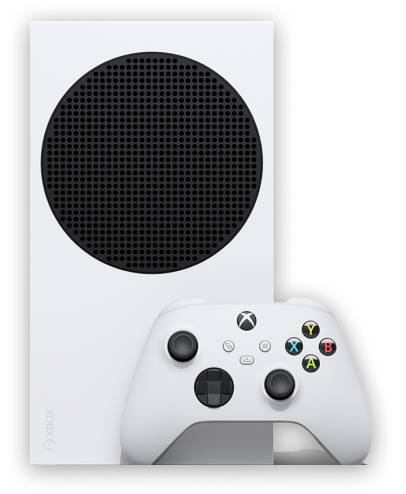

<h1 align="center">
 
    
    
 
</h1>

Foi criado uma Landing Page com Scroll automático e que pode ser clicavel tambem para acontecer o evento de Javascript, Após acontecer o click demora 9 segundos para voltar o Scroll automático e se caso não acontecer vai dar scroll em um intervalo de 5 Segundos, tambem foi utilizado LESS(pré-processador de CSS)

  

    

 

## Tecnologias

O projeto foi desenvolvido com as seguintes Tecnologias:

- Javascript
- HTML 5
- CSS
- LESS

---

Feito por Matheus Bezerra, entre em contato pelo Linkedin --> <a href="https://www.linkedin.com/in/matheus-bezerra04/">Matheus-Bezerra04</a>

Ou entre em contato pelo Numero (11) 97661-1929

